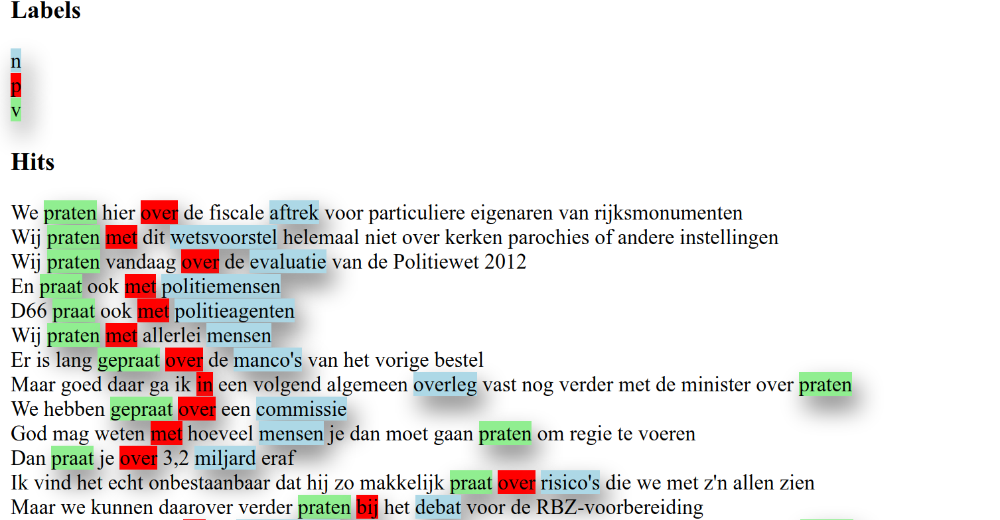
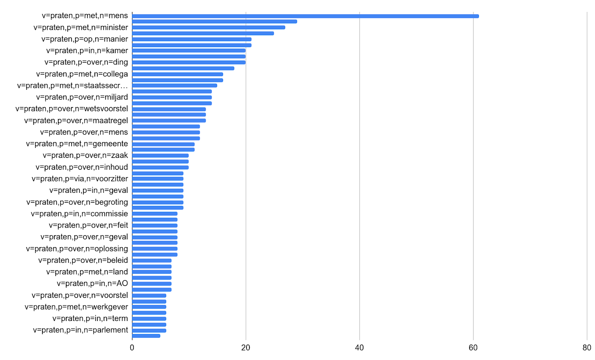

# Exploiting UD treebanks for the extraction of word combination statistics

## Metadata

* **Status:**  Proposed
* **Type:** Specific
* **Work Package**: WP3
* **Research Coordinators:**  INT Lexicographers
* **Coordinators for CLARIAH:**  Jesse de Does, Vincent Vandeghinste
* **Participating Institutes:** INT
* **End-users**: INT Lexicographers; Lut Colman, Carole Tiberius
* **Developers**: (Who is involved in implementing this use-case (if any)? Try to mention name, institute, role/responsibility)
* **Interest Groups**: (a list of CLARIAH interest groups, such as Text and DevOps, for which this use case may be relevant. See the list of IG's at: https://github.com/clariah/ig/.
* **Task IDs**: Wp3 search engine extensions: parallel corpora; treebanks

## Description

### What is the research about?

Using dependency treebanks to study verbal-headed word combinations (cf. INT word combinations project)

### What problem is hindering the research?

The scala of current corpus environments lacks a middle ground,  where the extremes are sketch engine/blacklab/CQP on the one hand (fast and easy search in large amounts of material, flexible possibilities for grouping and result display) and Gretel/PaQu (extensive search possibilities but not yet fast with large corpora) on the other hand. 

### What is needed to do the research?

We propose extensions to blacklab/blacklab-server/autosearch 

* to enable fast retrieval by dependency relations
* extraction of relevant statistics by grouping on the relevant slots in the queries
* upload of treebank data created by researchers into autosearch
* exploitation of existing parallel corpora

#### Data

* Existing UD treebanks
* UD-enriched version of OpenSONAR and other corpora

#### Tools

* extended version of blacklab/autosearch
* UD pipeline for Dutch (to be determined by accuracy/usability)

### What software and services are involved?

### How to evaluate this?

* Is the researched satisfied?

## References

References to related resources and publications and especially links to related use-cases:

* [CLARIAH](https://clariah.nl)

